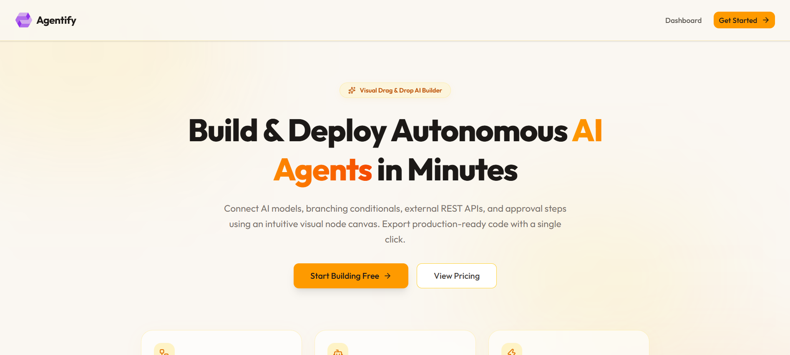
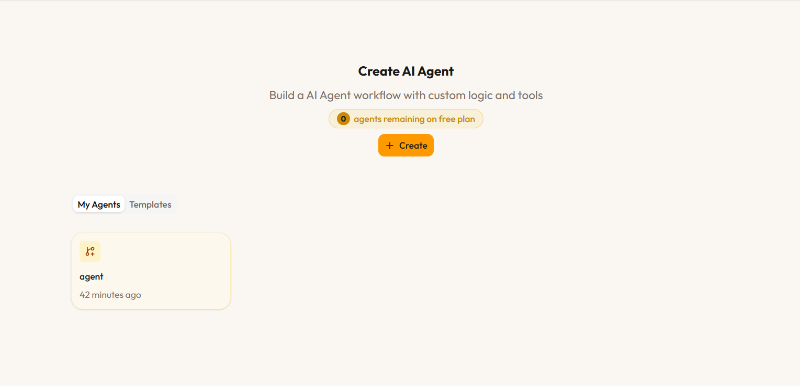
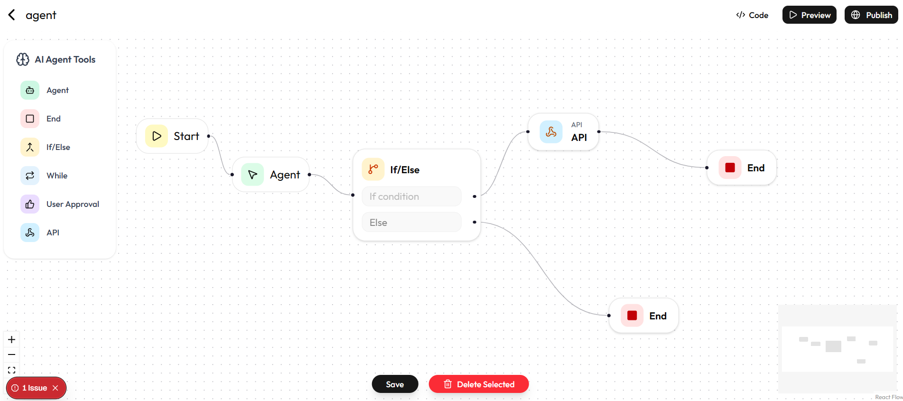

# Agentify 🤖✨

Agentify is a powerful, visual drag-and-drop platform for building and deploying autonomous AI agents in minutes. Connect AI models, logic flows, external REST APIs, and condition checks seamlessly using an intuitive node canvas.

## ✨ Features

- **Visual Node Canvas**: Drag and drop agents, loops, webhooks, and conditionals using a dynamic React Flow interface.
- **Autonomous Agents**: Native multi-agent coordination with the OpenAI Agent SDK and streaming token responses.
- **Instant Deployment**: Publish live agents and integrate them into any frontend.
- **Built-in Monetization & Limits**:
  - Secure Authentication via **Clerk**.
  - Advanced Rate Limiting and Token Buckets powered by **Arcjet** (e.g., 5,000 tokens auto-refilling every 5 days).
  - Premium Subscriptions via **Stripe** to unlock unlimited agents.
- **Stunning UI**: Custom "Warm Obsidian & Solar Gold" premium design aesthetic, built with Tailwind CSS and Shadcn UI.

## 📸 Screenshots





## 🛠️ Tech Stack

- **Framework**: [Next.js](https://nextjs.org) (App Router)
- **Backend & Database**: [Convex](https://convex.dev/) (Real-time backend as a service)
- **Authentication**: [Clerk](https://clerk.com/)
- **Rate Limiting**: [Arcjet](https://arcjet.com/)
- **Styling**: [Tailwind CSS](https://tailwindcss.com) + [Shadcn UI](https://ui.shadcn.com/)
- **Flow Engine**: [React Flow](https://reactflow.dev/)
- **AI Integration**: OpenAI SDK

## 🚀 Getting Started

### Prerequisites
Make sure you have Node.js and npm (or pnpm/yarn/bun) installed. You will also need active API keys for Clerk, Convex, Arcjet, and OpenAI.

### 1. Clone the repository
```bash
git clone https://github.com/your-username/agentify.git
cd agentify
```

### 2. Install Dependencies
```bash
npm install
```

### 3. Environment Variables
Create a `.env.local` file in the root directory and add the following variables:
```env
NEXT_PUBLIC_CLERK_PUBLISHABLE_KEY=your_clerk_key
CLERK_SECRET_KEY=your_clerk_secret

CONVEX_DEPLOYMENT=your_convex_deployment
NEXT_PUBLIC_CONVEX_URL=your_convex_url

ARCJET_KEY=your_arcjet_key
OPENAI_API_KEY=your_openai_key
```

### 4. Start the Development Server
Run the Next.js frontend and Convex backend simultaneously:
```bash
npm run dev
# In a separate terminal run: npx convex dev
```

Open [http://localhost:3000](http://localhost:3000) with your browser to see the app.

## 🎨 Design System

Agentify uses a highly curated design system called **Warm Obsidian & Solar Gold**:
- **App Canvas**: Warm Sand (`#FAF7F2`)
- **Sidebar**: Obsidian Gold (`#1C1917`)
- **Primary Accents**: Solar Gold (`#F59E0B`)
- **Typography**: Deep Espresso (`#18181B`) and Warm Umber (`#78716C`)

## 📄 License

This project is licensed under the MIT License.
