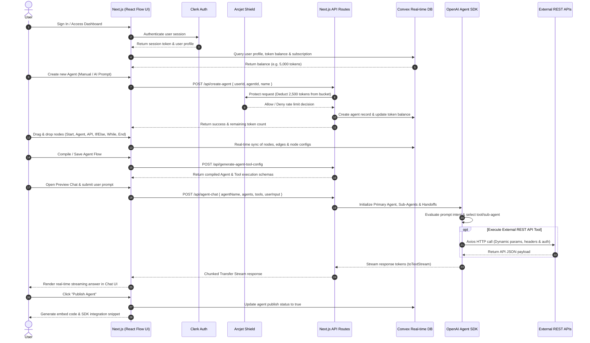

# Agentify 🤖✨

Agentify is a powerful, visual drag-and-drop platform for building and deploying autonomous AI agents in minutes. Connect AI models, logic flows, external REST APIs, and condition checks seamlessly using an intuitive node canvas.

## ✨ Features

- **Visual Node Canvas**: Drag and drop agents, loops, webhooks, and conditionals using a dynamic React Flow interface.
- **Autonomous Agents**: Native multi-agent coordination with the OpenAI Agent SDK and streaming token responses.
- **Instant Deployment**: Publish live agents and integrate them into any frontend.
- **Built-in Monetization & Limits**:
  - Secure Authentication via **Clerk**.
  - Advanced Rate Limiting and Token Buckets powered by **Arcjet** (e.g., 5,000 tokens auto-refilling every 5 days).
  - Premium Subscriptions via **Stripe** to unlock unlimited agents.
- **Stunning UI**: Custom "Warm Obsidian & Solar Gold" premium design aesthetic, built with Tailwind CSS and Shadcn UI.

## 📸 Screenshots


## 🛠️ Tech Stack

- **Framework**: [Next.js](https://nextjs.org) (App Router)
- **Backend & Database**: [Convex](https://convex.dev/) (Real-time backend as a service)
- **Authentication**: [Clerk](https://clerk.com/)
- **Rate Limiting**: [Arcjet](https://arcjet.com/)
- **Styling**: [Tailwind CSS](https://tailwindcss.com) + [Shadcn UI](https://ui.shadcn.com/)
- **Flow Engine**: [React Flow](https://reactflow.dev/)
- **AI Integration**: OpenAI SDK

## 🚀 Getting Started

### Prerequisites
Make sure you have Node.js and npm (or pnpm/yarn/bun) installed. You will also need active API keys for Clerk, Convex, Arcjet, and OpenAI.

### 1. Clone the repository
```bash
git clone https://github.com/your-username/agentify.git
cd agentify
```

### 2. Install Dependencies
```bash
npm install
```

### 3. Environment Variables
Create a `.env.local` file in the root directory and add the following variables:
```env
NEXT_PUBLIC_CLERK_PUBLISHABLE_KEY=your_clerk_key
CLERK_SECRET_KEY=your_clerk_secret

CONVEX_DEPLOYMENT=your_convex_deployment
NEXT_PUBLIC_CONVEX_URL=your_convex_url

ARCJET_KEY=your_arcjet_key
OPENAI_API_KEY=your_openai_key
```

### 4. Start the Development Server
Run the Next.js frontend and Convex backend simultaneously:
```bash
npm run dev
# In a separate terminal run: npx convex dev
```

Open [http://localhost:3000](http://localhost:3000) with your browser to see the app.

## 📂 Project Structure

```text
agentify/
├── app/                                # Next.js App Router
│   ├── (auth)/                         # Authentication routes (Clerk)
│   │   ├── sign-in/                    # Sign-in page
│   │   └── sign-up/                    # Sign-up page
│   ├── agent-builder/                  # Visual Agent Flow Canvas
│   │   ├── [agentId]/                  # Dynamic Agent Editor & Builder
│   │   │   ├── preview/                # Live Interactive Agent Testing / Preview
│   │   │   │   └── _components/        # ChatUI and testing components
│   │   │   └── page.tsx                # Main Canvas Workspace (React Flow)
│   │   ├── _components/                # Canvas UI (Header, Tool Panels, Publish Dialog)
│   │   ├── _customNodes/               # Custom React Flow Nodes
│   │   │   ├── StartNode.tsx           # Entrypoint trigger node
│   │   │   ├── AgentNode.tsx           # Sub-agent configuration node
│   │   │   ├── ApiNode.tsx             # External REST API tool node
│   │   │   ├── IfElseNode.tsx          # Conditional branching logic node
│   │   │   ├── WhileNode.tsx           # Looping / iteration node
│   │   │   ├── UserApprovalNode.tsx    # Human-in-the-loop approval node
│   │   │   └── EndNode.tsx             # Flow termination node
│   │   └── _nodeSettings/              # Configuration sidebars for each node type
│   ├── api/                            # Backend API Routes
│   │   ├── agent-chat/                 # OpenAI Agent SDK streaming execution endpoint
│   │   ├── agent-sdk/                  # SDK export & runner endpoint
│   │   ├── arcjet/                     # Arcjet rate-limiting / protection endpoints
│   │   ├── create-agent/               # Agent provisioning with token deduction
│   │   └── generate-agent-tool-config/ # Node graph to OpenAI Agent config compiler
│   ├── dashboard/                      # User Dashboard
│   │   ├── _components/                # Dashboard UI (Sidebar, Header, Agent List, Creator)
│   │   ├── my-agents/                  # User's created and published agents
│   │   ├── pricing/                    # Stripe subscription & upgrade plans
│   │   ├── profile/                    # User account settings & token balance
│   │   ├── layout.tsx                  # Dashboard layout with global navigation
│   │   └── page.tsx                    # Dashboard home
│   ├── layout.tsx                      # Root HTML layout with providers
│   ├── page.tsx                        # Public landing page
│   └── provider.tsx                    # Convex, Clerk, and Theme providers wrapper
├── components/                         # Shared UI Components
│   ├── ui/                             # Shadcn UI primitives (dialog, button, input, etc.)
│   ├── ThemeProvider.tsx               # Next Themes wrapper
│   └── ThemeToggle.tsx                 # Dark/Light theme toggle
├── config/                             # Third-party integrations config
│   ├── Arcjet.ts                       # Arcjet token bucket & security setup
│   └── OpenAi.ts                       # OpenAI client initialization
├── context/                            # React Context Providers
│   ├── UserDetailContext.tsx           # Global user profile and token state
│   └── WorkflowContext.tsx             # Global agent builder workflow state
├── convex/                             # Convex Real-Time Database & Backend
│   ├── schema.ts                       # Schema definitions (UserTable, AgentTable, ConversationTable)
│   ├── user.ts                         # User queries and token mutations
│   ├── agent.ts                        # Agent CRUD, publish status, and node sync
│   └── Conversation.ts                 # Conversation session management
└── public/                             # Static assets and icons
```

## 🔄 Application Workflow



### End-to-End Lifecycle:

1. **User Onboarding & Token Allocation**:
   - Users authenticate securely via **Clerk**.
   - User profiles and token balances (defaulting to 5,000 tokens) are initialized in **Convex** (`UserTable`).
   - Rate limiting and token bucket consumption are protected per-user via **Arcjet**.

2. **Agent Creation & Canvas Construction**:
   - Creating a new agent checks user subscription status or deducts tokens (2,500 tokens) via Arcjet protection rules.
   - Users enter a visual **React Flow** editor to compose multi-agent workflows using specialized nodes:
     - **Start Node**: Defines trigger conditions and entry input.
     - **Agent Node**: Defines specialized autonomous sub-agent behaviors and instructions.
     - **API Node**: Connects external REST APIs with dynamic endpoints, HTTP methods, headers, and payloads.
     - **If/Else Node**: Facilitates branching logic based on context evaluation.
     - **While Node**: Enables iterative task execution until criteria are met.
     - **User Approval Node**: Pauses execution for human-in-the-loop confirmation.
     - **End Node**: Concludes the workflow and defines output formats.

3. **Compilation & Dynamic Tool Binding**:
   - The graph topology is compiled via `/api/generate-agent-tool-config`.
   - Custom API nodes are automatically wrapped as executable `@openai/agents` tools with dynamic Zod schemas and Axios HTTP execution.
   - Primary coordinator agents and sub-agents are wired together with native handoffs.

4. **Interactive Live Testing & Streaming**:
   - The `/agent-builder/[agentId]/preview` route provides a sandboxed chat environment.
   - Queries are streamed token-by-token in real time via chunked HTTP transfer from the OpenAI Agent SDK.
   - Multi-turn conversation sessions are tracked in Convex (`ConversationTable`).

5. **Publishing & Integration**:
   - Workflows can be published with a single click, generating production-ready integration snippets for external apps.

## 🎨 Design System

Agentify uses a highly curated design system called **Warm Obsidian & Solar Gold**:
- **App Canvas**: Warm Sand (`#FAF7F2`)
- **Sidebar**: Obsidian Gold (`#1C1917`)
- **Primary Accents**: Solar Gold (`#F59E0B`)
- **Typography**: Deep Espresso (`#18181B`) and Warm Umber (`#78716C`)

## 📄 License

This project is licensed under the MIT License.
